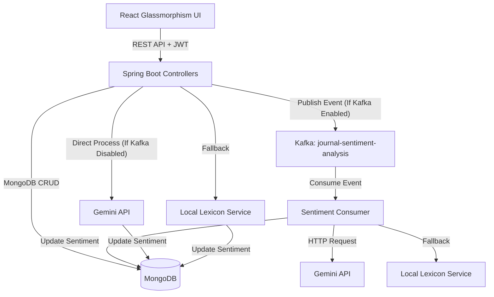

# JournalAI — Secure Mindfulness Vault & Sentiment Intelligence

JournalAI is a modern, recruiter-ready, and portfolio-worthy personal journal application built using **Java Spring Boot**, **MongoDB**, **Apache Kafka**, and a **Vite-React** frontend styled with a premium **Liquid Glassmorphism** design system.

The application allows users to securely record daily thoughts, tasks, and expenses in independent modules, while analyzing the sentiment of their entries using the **Gemini API** with a custom **Local Lexicon Fallback** system (supporting both asynchronous Kafka event messaging and local synchronous processing).

---

## 🚀 Key Features

- **Dynamic Multi-Mode Entry System**: Log journals, manage to-do checklists, or track expenses from independent, customized glassmorphic sub-forms.
- **Hybrid Sentiment Intelligence**: Supports asynchronous event streaming via Apache Kafka, or falls back to direct synchronous analysis if Kafka is disabled locally (`spring.kafka.enabled=false`). The processor calls the **Gemini API** and falls back to a **Local Lexicon Service** if the API is offline.
- **Premium Liquid Glass UI**: Sleek dark mode styling featuring teal and cyan glows, custom focus states, light/dark mode transitions, and page-load animations.
- **Robust Security & Validation**: Strict CORS mappings, local standalone transaction fallbacks, unified request validation, and clean `@RestControllerAdvice` error responses.

---

## 🛠️ Technical Stack

- **Backend**: Java 17, Spring Boot 3.5.x, Spring Security (Stateless JWT), Spring Kafka, Spring Data MongoDB.
- **Frontend**: React 19, Vite, Tailwind CSS v4, Framer Motion, Lucide React icons.
- **Data & Pipelines**: MongoDB (Local/Cloud), Apache Kafka Event Streams.

---

## 📂 Project Architecture



---

## 🔧 Installation & Setup

### 1. Prerequisites
- **Java JDK 17** or higher
- **Node.js** v18+ & npm
- **MongoDB** running on `localhost:27017`
- **Apache Kafka** running on `localhost:9092`

### 2. Environment Setup
Create a `.env` file in the root directory (based on `.env.example`):
```bash
MONGODB_URI=mongodb://localhost:27017/journalDb
JWT_SECRET=your_jwt_secret_key_min_32_chars
CLAUDE_API_KEY=your_anthropic_api_key
KAFKA_BOOTSTRAP_SERVERS=localhost:9092
```

### 3. Run Backend
```bash
cd backend
mvn clean spring-boot:run
```

### 4. Run Frontend
```bash
cd frontend
npm install
npm run dev
```

---

## 🛰️ Key APIs

| Method | Endpoint | Description | Auth Required |
| :--- | :--- | :--- | :--- |
| `POST` | `/public/signup` | Register new user account | No |
| `POST` | `/public/login` | Login and receive JWT access token | No |
| `GET` | `/journal` | Fetch paged entries for logged-in user | Yes |
| `POST` | `/journal` | Create a new journal entry (triggers Kafka) | Yes |
| `PUT` | `/journal/id/{id}` | Update an existing journal entry | Yes |
| `DELETE`| `/journal/id/{id}` | Permanently delete entry | Yes |
| `GET` | `/journal/id/{id}/sentiment` | Fetch or trigger sentiment analysis | Yes |
| `GET` | `/admin/all-users` | Fetch all user metadata (Admin role only) | Yes (Admin) |
